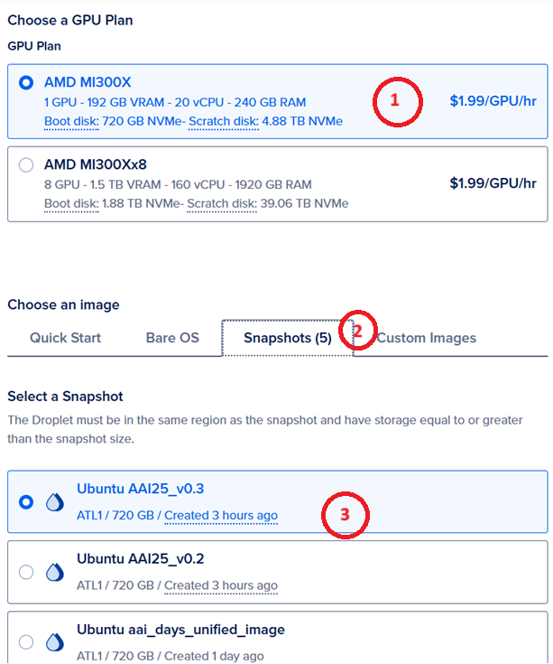

# This DOC is only compatible before the commit `c2dac2e6b13054e0e8acc44a4aac322519af32d5` and will be deprecated soon.
# WORKSHOP 102 Fine-tuning LLaMA 3.2 11B and 90B vision model with LoRA and qLoRA technique on MI300X single gpu


## How to start: 

### Create a Single vLLM MI300X GPU Droplet
Start by creating a Digital Ocean Droplet. Choose the AAI snapshot shown below.



Then add your ssh key and create a single GPU image.

### Open jupyter notebook in your browser

Enter the URL in your browser. Then add 8102 as the port. Finally we should fill in `AAI25` as the token

***IMPORTANT NOTE** Please make sure the URL starts with `http` rather than `https` as the later is not reachable.


### Download the workshop notebook into specific folder and execute

```bash
# enter the container environment
docker exec -it rocm /bin/bash

# enter the default jupyter folder
cd /var/lib/jenkins/jupyter

# git clone the repo
git clone --recursive https://github.com/seungrokj/AAI25_workshop/

```


Once your notebook is loaded you are ready to go. Follow the instructions in the notebook after that.
