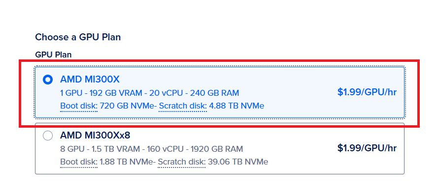
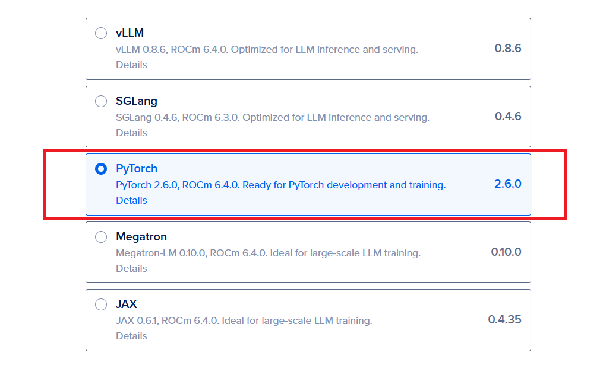
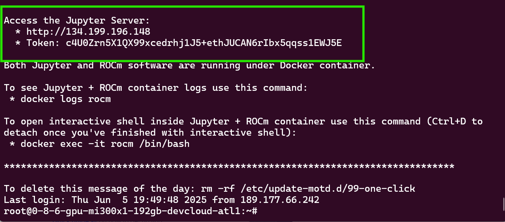
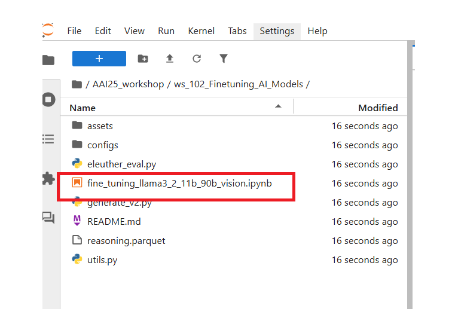

# WORKSHOP 102 Fine-tuning LLaMA 3.2 11B and 90B vision model with LoRA and qLoRA technique on MI300X single gpu


## How to start: 

### Create a Single vLLM MI300X GPU Droplet
Start by creating a Digital Ocean Droplet. Choose the PyTorch droplet shown below.




Then add your ssh key and create a single GPU image.

### Retrieve Jupyter Server Address + Token

Once the image is created you can either ssh to your VM or use the `Web Console` button to enter the VM. Once you are in the VM you should see your jupyter server credentials printed for you as shown below:



Enter the URL in your browser. Then copy the token in the first box where it prompts you for the token.

***IMPORTANT NOTE** Please make sure the URL starts with `http` rather than `https` as the later is not reachable.


### Download the workshop notebook into specific folder and execute

```bash
# enter the container environment
docker exec -it rocm /bin/bash

# enter the default jupyter folder
cd /home/rocm-user/jupyter

# git clone the repo
git clone --recursive https://github.com/seungrokj/AAI25_workshop/

```



Once your notebook is loaded you are ready to go. Follow the instructions in the notebook after that.
