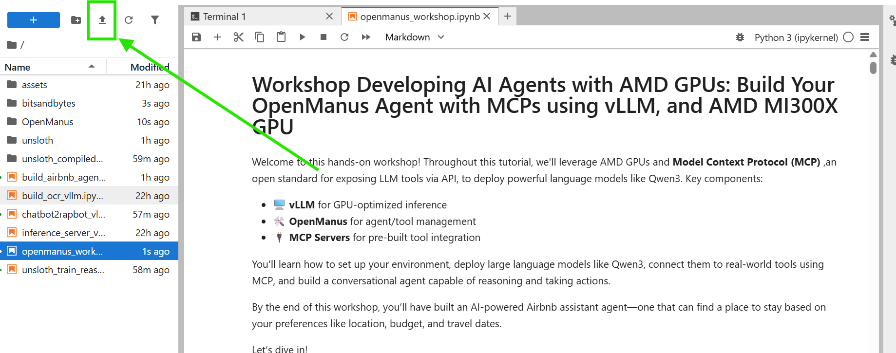

# Table of content

## How to start: 

### Create a Single vLLM MI300X GPU Droplet
Start by creating a Digital Ocean Droplet. Choose the vLLM droplet shown below.

Then add your ssh key and create a single GPU image.

### Retrieve Jupyter Server Address + Token

Once the image is created you can either ssh to your VM or use the `Web Console` button to enter the VM. Once you are in the VM you should see your jupyter server credentials printed for you as shown below:

Enter the URL in your browser. Then copy the token in the first box where it prompts you for the token.

***IMPORTANT NOTE** Please make sure the URL starts with `http` rather than `https` as the later is not reachable.

### Upload the workshop notebook and execute

Now just download the notebook [here](./openmanus_workshop.ipynb) and upload in your notebook as shown below.

Once your notebook is loaded you are ready to go. Follow the instructions in the notebook after that.
