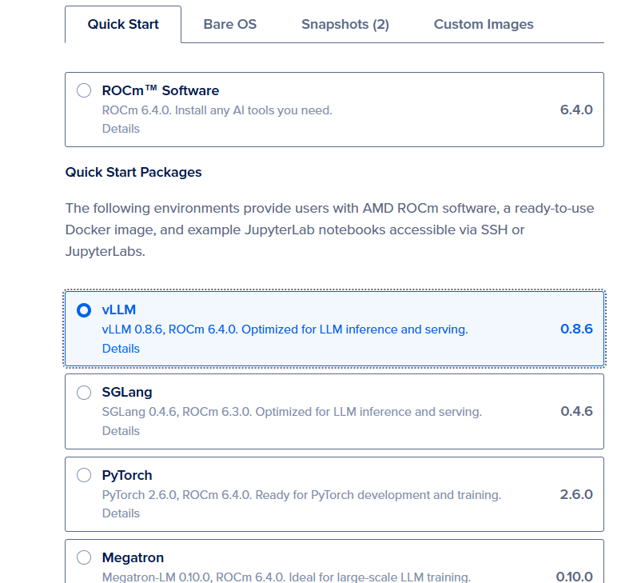

# Table of content

## How to start: 

### Create a Single vLLM MI300X GPU Droplet
Start by creating a Digital Ocean Droplet. Choose the vLLM droplet shown below.




Then add your ssh key and create a single GPU image.

### Retrieve Jupyter Server Address + Token

Once the image is created you can either ssh to your VM or use the `Web Console` button to enter the VM. Once you are in the VM you should see your jupyter server credentials printed for you as shown below:


Enter the URL in your browser. Then copy the token in the first box where it prompts you for the token.

***IMPORTANT NOTE** Please make sure the URL starts with `http` rather than `https` as the later is not reachable.


### Prepare Jupyter Notebook tutorials

Once your notebook is loaded,

Launch Terminal and type these to downaload Jupyter Notebook 
```sh
git clone https://github.com/seungrokj/AAI25_workshop.git
cd AAI25_workshop/ws_201_Optimized_Model_Serving_with_vLLM
cp CLIENT_ws_201.ipynb /app/jupyter/
cp rpt_sum.sh /app/jupyter
```

Double cloick CLIENT_ws_201.ipynb and now let's begin


