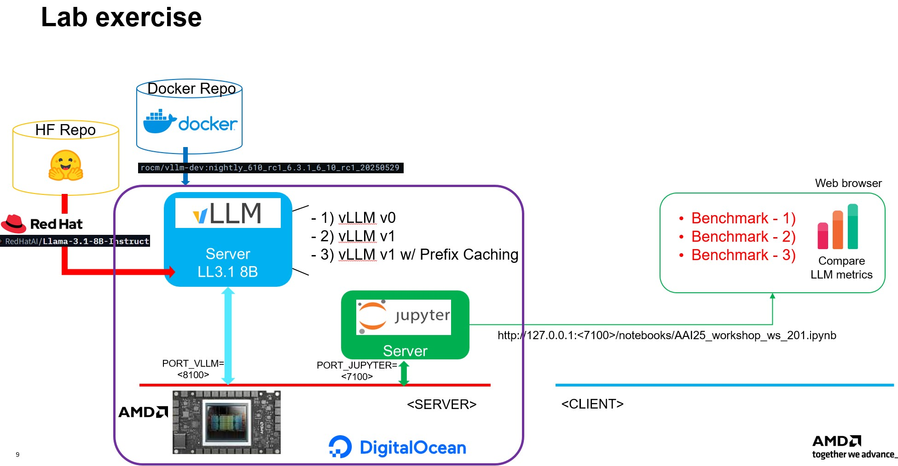

# Table of content

0. [BEFORE WE BEGIN](#before-we-begin)
    1. [Case 1 vLLM v0 benchmarks](#case-1-vllm-v0-benchmarks)
    2. [Case 2 vLLM v1 benchmarks](#case-2-vllm-v1-benchmarks)
    3. [Case 3 vLLM v1 with Prefix-caching benchmarks](#case-3-vllm-v1-with-prefix-caching-benchmarks)

# BEFORE WE BEGIN

In this workshop, we will run three vLLM servers and compare the caracteristics of each server. 



## Connecting to Digital Ocean Cloud Instance

 - 📌 IMPORTANT: Check out Digital Ocean Cloud Quick Start Guide at [digital ocean quick start](../Digital_Ocean_Usage/README.md)

### Please use these to connect to your instace

```
ssh -L 7100:localhost:7100 -L 8100:localhost:8100 root@DIGITAL_OCEAN_INSTANCE_IP

# Inside the host machine
export PORT_VLLM=8100
export PORT_JUPYTER=7100
export model=/models/Llama-3.1-8B-Instruct
```

## ✨ 
## Case 1 vLLM v0 benchmarks
-----------------------------

Please down load LLAMA3.1 8B model from [RedHatAI/Llama-3.1-8B-Instruct](https://huggingface.co/RedHatAI/Llama-3.1-8B-Instruct) at ./models

```
mkdir models
cd models
git-lfs clone https://huggingface.co/RedHatAI/Llama-3.1-8B-Instruct
```

### SERVER) vLLM v0 default option

```
docker run -it --rm --network=host \
    --device=/dev/kfd --device=/dev/dri \
    --ipc=host --shm-size 16G \
    --group-add video \
    --cap-add=SYS_PTRACE \
    --security-opt seccomp=unconfined \
    -e VLLM_USE_V1=0 \
    -e VLLM_USE_TRITON_FLASH_ATTN=0 \
    -v /root/models:/models \
    rocm/vllm-dev:nightly_610_rc1_6.4.1_6_10_rc1_20250529 \
    vllm serve $model \
            --disable-log-requests \
            --trust-remote-code -tp 1 \
            --cuda-graph-sizes 64 \
            --chat-template /app/vllm/examples/tool_chat_template_llama3.1_json.jinja \
            --port $PORT_VLLM
```

Once servers are ready, you can see these logs in the terminal

```
INFO:     Started server process [1]
INFO:     Waiting for application startup.
INFO:     Application startup complete.
```

### CLIENT) Launch Jupyternotebook servers on the AMD host machine

In an other terminal, now ssh again into the AMD host machine 

```
ssh -L 7100:localhost:7100 -L 8100:localhost:8100 root@DIGITAL_OCEAN_INSTANCE_IP

# Inside the host machine
export PORT_VLLM=8100
export PORT_JUPYTER=7100
export model=/models/Llama-3.1-8B-Instruct
```

#### Launch Jupyter notebook container and access it via a web browser

Launch this Jupyter notebook container

```
docker run -it --rm -u root --entrypoint /bin/bash --net host \
    -v $(pwd):/workspace -v /root/models:/models \
    -e PORT_JUPYTER=$PORT_JUPYTER \
    jupyter/base-notebook

```

Inside the container, please clone this workshop repo
```
apt update
apt install git -y
cd /workspace
git clone https://github.com/seungrokj/AAI25_workshop
cd AAI25_workshop/ws_201_Optimized_Model_Serving_with_vLLM
```

Launch the Jupyter notebook

```
jupyter-notebook --allow-root --port $PORT_JUPYTER
```

You can access the Jupyter notebook server that starts with http:/127.0.0.1:<7100> below

```
[I 2025-06-05 02:45:44.737 ServerApp] Jupyter Server 2.8.0 is running at:
[I 2025-06-05 02:45:44.737 ServerApp] http://rocm-jupyter-gpu-mi300x1-192gb-devcloud-atl1:7100/tree?token=f41e3eaed66871280f3ae6d5679a4ad59a1583fec87d5523
[I 2025-06-05 02:45:44.737 ServerApp]     http://127.0.0.1:7100/tree?token=f41e3eaed66871280f3ae6d5679a4ad59a1583fec87d5523
[I 2025-06-05 02:45:44.737 ServerApp] Use Control-C to stop this server and shut down all kernels (twice to skip confirmation).
[C 2025-06-05 02:45:44.738 ServerApp]
```

Now follow steps in the `AAI25_workshop_ws_201.ipynb`

## ✨ 
## Case 2 vLLM v1 benchmarks
-----------------------------

Now close the previous vLLM server by `ctrl+C` and launch a new vLLM server with v1 enabled
Chekc out `VLLM_USE_V1=1` env var to grigger v1. 
And follow instructions at `AAI25_workshop_ws_201.ipynb`

### SERVER) vLLM v1 without prefix-caching

```
docker run -it --rm --network=host \
    --device=/dev/kfd --device=/dev/dri \
    --ipc=host --shm-size 16G \
    --group-add video \
    --cap-add=SYS_PTRACE \
    --security-opt seccomp=unconfined \
    -e VLLM_USE_V1=1 \
    -e VLLM_V1_USE_PREFILL_DECODE_ATTENTION=1 \
    -v /root/models:/models \
    rocm/vllm-dev:nightly_610_rc1_6.4.1_6_10_rc1_20250529 \
    vllm serve $model \
            --disable-log-requests \
            --trust-remote-code -tp 1 \
            --cuda-graph-sizes 64 \
            --no-enable-prefix-caching \
            --chat-template /app/vllm/examples/tool_chat_template_llama3.1_json.jinja \
            --port $PORT_VLLM
```

### CLIENT) Keep following instructions at `AAI25_workshop_ws_201.ipynb`

## ✨ 
## Case 3 vLLM v1 with Prefix-caching benchmarks
-----------------------------

Now close the previous vLLM server by `ctrl+C` and launch a new vLLM server with v1 and prefix cache are enabled
Chekc out `VLLM_USE_V1=1` env var to grigger v1 and `--enable-prefix-caching` vllm arg to enabled prefix caching. 

### SERVER) vLLM v1 with prefix-caching

```
docker run -it --rm --network=host \
    --device=/dev/kfd --device=/dev/dri \
    --ipc=host --shm-size 16G \
    --group-add video \
    --cap-add=SYS_PTRACE \
    --security-opt seccomp=unconfined \
    -e VLLM_USE_V1=1 \
    -e VLLM_V1_USE_PREFILL_DECODE_ATTENTION=1 \
    -v /root/models:/models \
    rocm/vllm-dev:nightly_610_rc1_6.4.1_6_10_rc1_20250529 \
    vllm serve $model \
            --disable-log-requests \
            --trust-remote-code -tp 1 \
            --cuda-graph-sizes 64 \
            --enable-prefix-caching \
            --chat-template /app/vllm/examples/tool_chat_template_llama3.1_json.jinja \
            --port $PORT_VLLM
```

### CLIENT) Keep following instructions at `AAI25_workshop_ws_201.ipynb`
