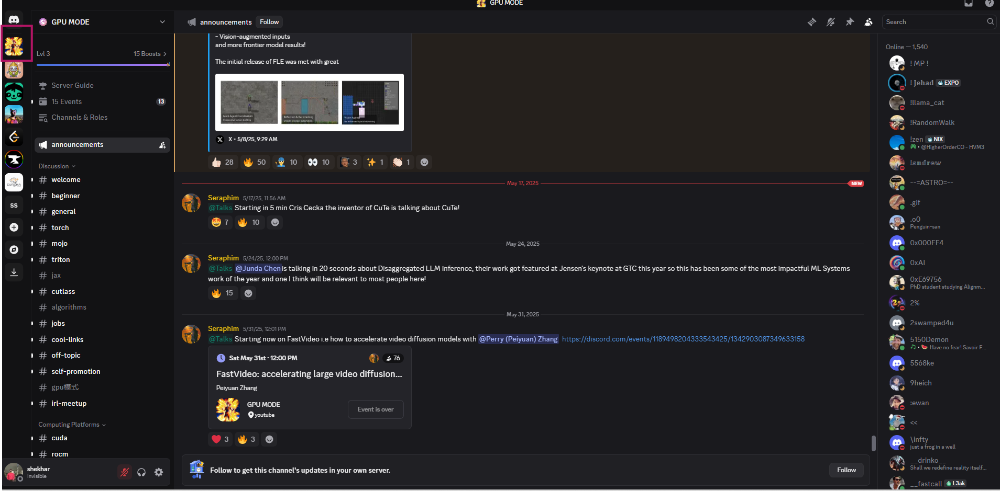
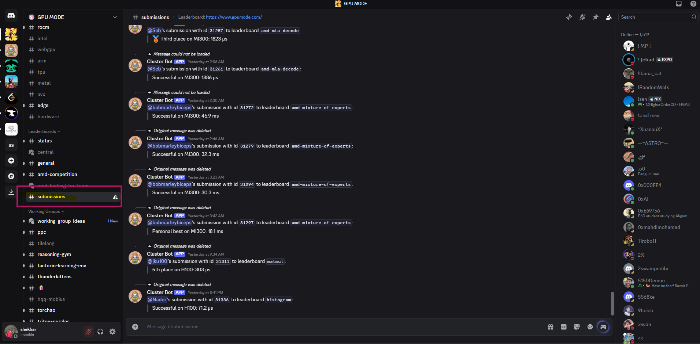
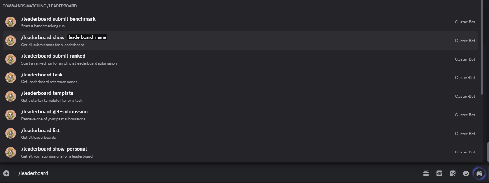
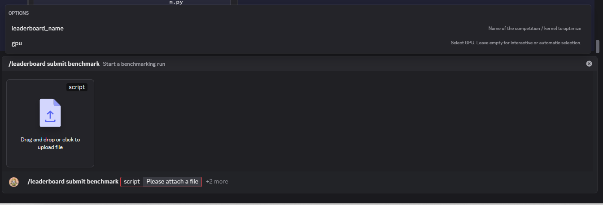
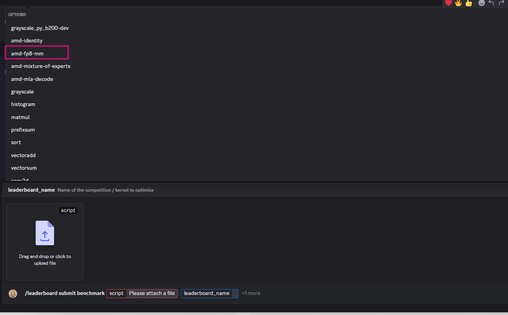
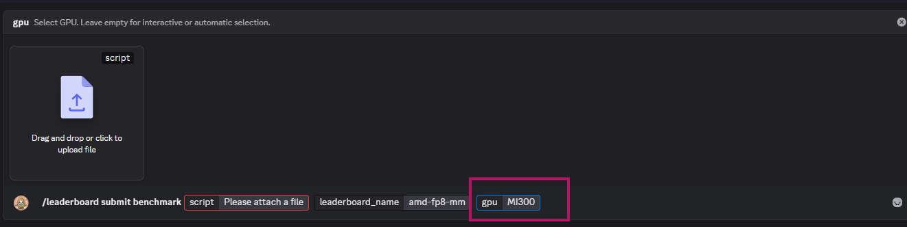

# Submission on GPU Mode

**Step 1**: Join GPU MODE discord using this invite link: [https://discord.gg/gpumode](https://discord.gg/gpumode)

If You don’t have discord account, it will take 2 mins.

**Note:** Ask participants to create a discord account when the workshop intro starts.

**Step 2:** Click on the GPU mode tab in red as pointed in the screenshot.

**Step 3:**  to download the reference kernel.

- Open powershell or any terminal you have
- And Run `wget [https://raw.githubusercontent.com/gpu-mode/reference-kernels/refs/heads/main/problems/amd/fp8-mm/reference.py`](https://raw.githubusercontent.com/gpu-mode/reference-kernels/refs/heads/main/problems/amd/fp8-mm/reference.py%60) your reference.py file will be downloaded. Then you can open and edit with your preferred editor.

Step 4: In the GPU mode discord Scroll down and go to the submission channel. 

**Step 5:**

In the chat type `/leaderboard`, it will by default show all the options for the gpumode leaderboard.

You can pick any and play around but for this workshop we will be using the first one which is /leaderboard submit benchmark

**Step 6:** After you choose /leaderboard submit benchmark: click on leaderboard_name

**Step 7:**

Choose amd-fp8-mm from the leaderboard names:

Step 8: click on the GPU option and then type MI300 as mentioned in the screenshot below 

**Step 9:** Click on Drag and drop to upload your reference file.

**Step 10:** once you have uploaded the file, just hit enter, and your code will be submitted.